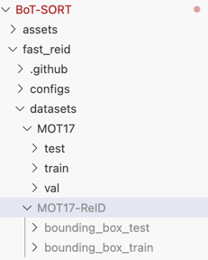

Please follow the instructions at https://github.com/niraharon/bot-sort
After cloning the repo, and following the instructions provided by the authors, you should prepare the data. Note, Sportsmot is already in MOT17 format, but you need further data preparation to make it work for this repo.
First, make sure you put the sportsmot dataset inside /fast_reid/datasets/MOT17 so that the folder MOT17 contains the train, test, val of the sportsmot dataset downloaded from the original competition link:

Then follow the instructions from the repo for the data preparation, but use my files:
- [generate_mot_patches.py](generate_mot_patches.py) for data preparation
- [train_net.py](train_net.py) for data training